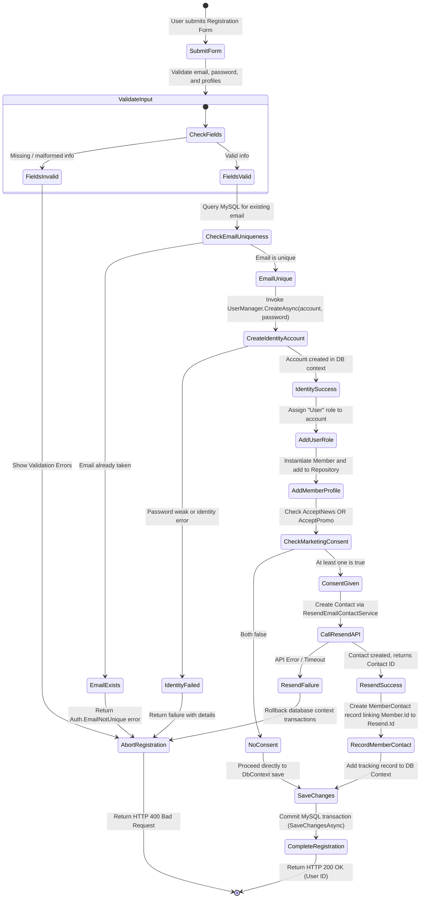
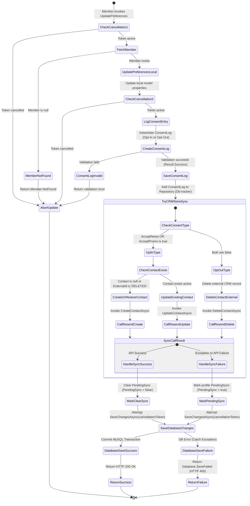

# Activity Diagrams

This document details the operational workflows of the Galvão system.

---

## 1. Member Registration & CRM Sync Workflow

This diagram outlines the step-by-step logic executed when a new user registers an account, which involves credentials validation, local profile persistence, and conditional sync to the Resend email marketing platform.

### Workflow Specification
* **Trigger**: A guest submits the Registration Form on the Angular SPA.
* **Key Decisions**:
  * **Input Check**: Validates field lengths and formats (e.g. valid email containing `@`).
  * **Email Uniqueness**: Queries the database to prevent duplicate registration.
  * **ASP.NET Identity Creation**: Validates password rules (length, digits, uppercase) and saves the auth login.
  * **Marketing Preferences Guard**: If the user did not opt-in to newsletters or promotions, CRM synchronization is skipped.
  * **Resend Integration API Response**: Calls Resend REST endpoints. If it fails (due to API key issues, network glitches, etc.), the database transaction is rolled back (`SaveChanges` is not called) and the registration fails to maintain consistency.
* **Final State**:
  * **Success**: The user has an authentication record, a local profile (`Member`), a tracked CRM identity (`MemberContact`), and receives an active account.
  * **Failure**: The transaction is aborted, no data is written, and error details (Problem Details JSON) are returned to the client.

---

## 2. Marketing Preferences Update & Audited Sync Workflow

This diagram outlines the step-by-step logic executed when a registered member updates their marketing preference settings. It involves consent auditing creation, cancellation token validation, and error-tolerant downstream sync mapping.

### Workflow Specification
* **Trigger**: An authenticated user modifies their newsletter options on the Angular Settings panel, issuing a PUT request.
* **Key Decisions**:
  * **CancellationToken Validation**: At major checkpoints, the handler verifies cancellation requests from the client.
  * **Consent Action Classification**: Computes whether the operation constitutes an "Opt-In" (any marketing flag enabled) or "Opt-Out" (all flags disabled) to record in the compliance log.
  * **Downstream Integration Sandbox**: Wraps the Resend API communication in a try-catch pattern. If the HTTP call to Resend succeeds, `PendingSync` is cleared. If the call times out or throws an exception, `PendingSync` is set to `true`, converting a blocking API call into a non-blocking queue.
* **Final State**:
  * **Success**: The user's preferences are updated in the database, a `ConsentLog` auditor is written, and the CRM matches (or will match after background reconciliation).
  * **Failure**: The database transaction fails, and the user's preferences remain unchanged.
