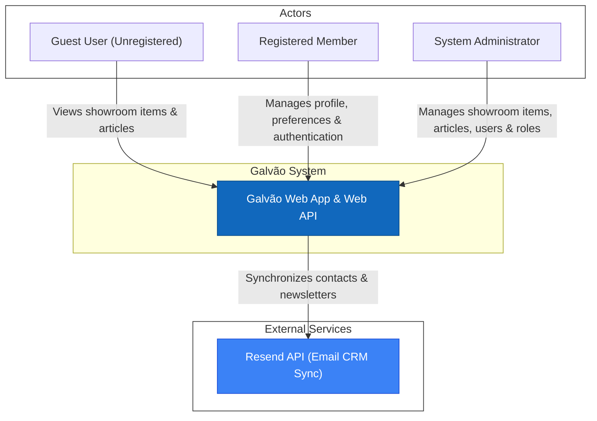
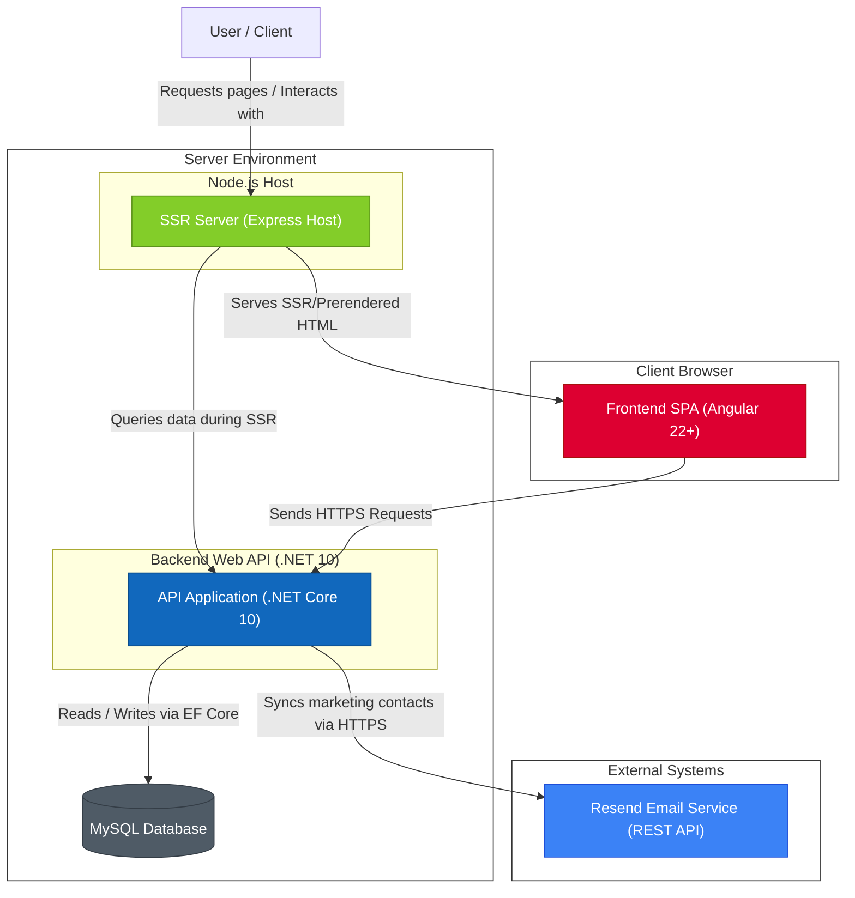
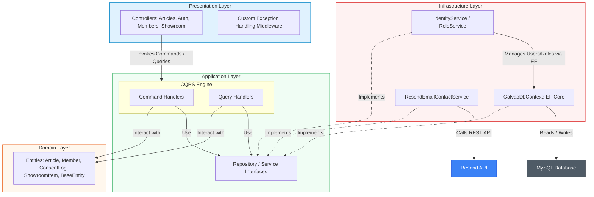

# C4 Model Diagrams

This document contains C4 Model diagrams representing the context, containers, and components of the Galvão system.

---

## 1. System Context Diagram (Level 1)

The System Context diagram provides a high-level view of the Galvão system, its users, and its external dependencies.

### System Context Description
* **Actors**:
  * **Guest User (Unregistered)**: Can browse the showroom items and read published news articles.
  * **Registered Member**: A authenticated user who can configure their profile (display name, email, name) and customize their newsletter preferences (marketing and promotion options).
  * **System Administrator**: Can log in to manage all resources (creating and editing showroom items/photos, writing and publishing articles, managing system roles and users).
* **Galvão System**: The core system providing the showroom catalog and news feeds, while handling profile and admin dashboards.
* **Resend API**: An external API used to manage contacts, marketing segments (news and promotion lists), and newsletter preferences.

---

## 2. Container Diagram (Level 2)

The Container diagram shows the high-level architecture of the Galvão system, illustrating the responsibilities, technologies, and interactions between the frontend, backend, and data stores.

### Containers Description
1. **SSR Server (Express Host)**: A Node.js environment hosting the Express server. It intercepts page requests from the user, executes Server-Side Rendering (SSR) by invoking Angular's platform-server engine (which queries backend data during compile-time), and serves pre-rendered (SSG) static assets or dynamically built HTML to the client browser.
2. **Frontend SPA**: An Angular (v22+) Single Page Application running in the user's browser after being hydrated from the SSR host. It uses Angular Signals for state management and communicates with the backend API via HTTP client interceptors.
3. **Backend Web API**: A cross-platform API built on .NET 10 using C# and Clean Architecture principles. It handles business logic, database mutations, role-based authorization, and external service communications.
4. **MySQL Database**: A MySQL database storing application credentials (users, claims, roles), showroom item metadata (titles, captions, prices), image URLs, article content, and compliant consent log ledgers. It is accessed via Entity Framework Core.
5. **Resend API**: External transactional and marketing email service. The backend syncs member contact details, opt-in statuses, and segments to this container over HTTPS.

---

## 3. Backend Component Diagram (Level 3)

The Component diagram dives into the Backend Web API, detailing how Clean Architecture layers interact to process requests.

### Components Description
* **Presentation Layer**:
  * **Controllers**: Expose RESTful endpoints. Inject Command/Query handlers and return formatted results using the `HandleResult` pattern.
  * **Custom Exception Handling Middleware**: Intercepts unhandled exceptions globally and formats them as standard RFC 7807 Problem Details.
* **Application Layer**:
  * **Command Handlers**: Implement mutations, calling domain factory methods and repositories.
  * **Query Handlers**: Execute read queries (often projecting directly to DTOs/Responses).
  * **Interfaces**: Define the boundaries of data access, Identity service actions, and external integrations (including `IConsentLogRepository`).
* **Domain Layer**:
  * Contains enterprise business logic, model constraints (like `Member.UpdateMarketingPreferences`), and pure domain entities (`Article`, `Member`, `ConsentLog`, `ShowroomItem`, `ShowroomItemPhoto`, `BaseEntity`). It has no dependencies on other layers or database providers.
* **Infrastructure Layer**:
  * **GalvaoDbContext**: The EF Core database session, mapping entities (including `ConsentLog`) to the MySQL schema and managing entity tracker states.
  * **IdentityService**: Implements user creation, password verification, and JWT generation/validation.
  * **ResendEmailContactService**: Invokes Resend HTTP endpoints to manage marketing segments and synchronize contact list statuses.
