# Class Diagrams

This document contains structural class diagrams depicting the Domain entities and relationships in the Galvão system.

---

## 1. Domain Entities Structural Diagram

The following class diagram models the core domain models defined in the `Galvao.Domain` layer, showcasing attributes, methods, inheritance, and cardinality.

```mermaid
classDiagram
    class BaseEntity {
        <<abstract>>
        +Guid Id
        +DateTime CreatedAt
        +DateTime? UpdatedAt
        +bool Active
        #BaseEntity()
        #BaseEntity(Guid id)
        +Update()
        +Activate()
        +UnActivate()
    }

    class Member {
        +string DisplayName
        +string Email
        +string FirstName
        +string LastName
        +bool AcceptNews
        +bool AcceptPromo
        +bool PendingSync
        -Member()
        -Member(email, displayName, firstName, lastName, acceptNews, acceptPromo)
        +Create(email, displayName, firstName, lastName, acceptNews, acceptPromo)$ Result~Member~
        +UpdateProfile(displayName, firstName, lastName) Result
        +UpdateMarketingPreferences(acceptNews, acceptPromo) Result
        +MarkAsPendingSync()
        +ClearPendingSync()
        +UpdateEmail(email) Result
    }

    class ConsentLog {
        +Guid MemberId
        +string Action
        +string? IpAddress
        +string? Source
        +string? ConsentToken
        -ConsentLog()
        -ConsentLog(memberId, action, ipAddress, source, consentToken)
        +Create(memberId, action, ipAddress, source, consentToken)$ Result~ConsentLog~
    }

    class MemberContact {
        +string ExternalContactId
        +string Email
        +bool Unsubscribed
        -MemberContact()
        -MemberContact(memberId, externalContactId, email, unsubscribed)
        +Create(memberId, externalContactId, email, unsubscribed)$ Result~MemberContact~
        +UpdateStatus(unsubscribed)
        +UpdateContactDetails(externalContactId, email) Result
    }

    class ShowroomItem {
        +string Title
        +string Description
        +decimal Price
        +string Category
        +IReadOnlyCollection~ShowroomItemPhoto~ Photos
        -List~ShowroomItemPhoto~ _photos
        -ShowroomItem()
        -ShowroomItem(title, description, price, category)
        +Create(title, description, price, category)$ Result~ShowroomItem~
        +UpdateDetails(title, description, price, category) Result
        +AddPhoto(url, caption, isPrimary) Result~ShowroomItemPhoto~
        +RemovePhoto(photoId) Result
        +SetPrimaryPhoto(photoId) Result
    }

    class ShowroomItemPhoto {
        +Guid ShowroomItemId
        +string Url
        +string Caption
        +bool IsPrimary
        -ShowroomItemPhoto()
        -ShowroomItemPhoto(showroomItemId, url, caption, isPrimary)
        +Create(showroomItemId, url, caption, isPrimary)$ Result~ShowroomItemPhoto~
        +SetAsPrimary()
        +ClearPrimary()
    }

    class Article {
        +string Title
        +string Content
        +string Author
        +DateTime? PublishedAt
        +bool IsPublished
        -Article()
        -Article(title, content, author)
        +Create(title, content, author)$ Result~Article~
        +UpdateContent(title, content, author) Result
        +Publish() Result
        +Unpublish() Result
    }

    class RemovedUser {
        +string Name
        +string Email
        +bool RemovedPersonalInformation
        +bool RemovedAccountData
        +bool RemovedMarketData
        +bool RemovedFromMailProvider
        -RemovedUser()
        -RemovedUser(name, email, removedPersonalInformation, removedAccountData, removedMarketData, removedFromMailProvider)
        +Create(name, email, removedPersonalInformation, removedAccountData, removedMarketData, removedFromMailProvider)$ Result~RemovedUser~
    }

    class EmailAuditLog {
        +Guid Id
        +Guid? MemberId
        +string RecipientEmail
        +string Subject
        +EMailProvider EMailProvider
        +ETypeOfMessage ETypeOfMessage
        +int StatusCode
        +string? ExternalMessageId
        +string? ErrorMessage
        +DateTime SentAtUtc
        -EmailAuditLog()
        -EmailAuditLog(memberId, recipientEmail, subject, eMailProvider, typeOfMessage, statusCode, externalMessageId, errorMessage)
        +Create(memberId, recipientEmail, subject, eMailProvider, typeOfMessage, statusCode, externalMessageId, errorMessage)$ EmailAuditLog
    }

    class EmailSegment {
        +Guid MemberContactId
        +MemberContact? MemberContact
        +ESegmentType ESegmentType
        +DateTime SubscriptionDate
        +DateTime? UnSubscriptionDate
        -EmailSegment()
        -EmailSegment(memberContactId, eSegmentType)
        +Create(memberContactId, eSegmentType)$ Result~EmailSegment~
        +SetSubscriptionDate(date)
        +SetUnSubscriptionDate(date)
    }

    BaseEntity <|-- Member
    BaseEntity <|-- ConsentLog
    BaseEntity <|-- MemberContact
    BaseEntity <|-- ShowroomItem
    BaseEntity <|-- ShowroomItemPhoto
    BaseEntity <|-- Article
    BaseEntity <|-- RemovedUser
    BaseEntity <|-- EmailSegment

    Member "1" *-- "1" MemberContact : Shares Identity Key / Cascade
    Member "1" *-- "*" ConsentLog : Audits Consent
    Member "1" *-- "*" EmailAuditLog : Traces Delivery / SetNull
    MemberContact "1" *-- "*" EmailSegment : Subscribes
    ShowroomItem "1" *-- "*" ShowroomItemPhoto : Contains / Backing Field
```

### Class Model Specification
* **BaseEntity**: The foundation class containing record identifiers and auditing fields (`CreatedAt`, `UpdatedAt`). It uses C# 12 `Guid.CreateVersion7()` to produce sequential, database-friendly UUIDs for primary keys.
* **Member**: Holds profile details. Has a strict one-to-one relationship mapped in the database with both the ASP.NET Core Identity `Account` and `MemberContact` tracking record. Exposes `PendingSync` to record unsynchronized CRM updates.
* **ConsentLog**: Models user consent actions ("Opt-In" / "Opt-Out") for marketing preferences. Linked in a one-to-many relationship under `Member` to serve as a tamper-proof auditing ledger.
* **MemberContact**: Tracks external marketing states. By sharing the primary key with `Member`, it guarantees integrity while avoiding composite navigation lookup overheads.
* **EmailSegment**: Linked to `MemberContact` in a one-to-many relationship mapping active marketing segments (`News` / `Promo`).
* **EmailAuditLog**: Audit log containing metadata of all messages sent from the system (recipient, subject, type, delivery code). Configured to set its `MemberId` to `null` if the member is purged, preserving audit integrity.
* **RemovedUser**: Auditable log of accounts that have been deleted, tracking status of data purging steps (Identity deletion, database member removal, and CRM segment unsubscription).
* **ShowroomItem**: Exposes showroom items. Controls access to photos via an encapsulated read-only collection `IReadOnlyCollection<ShowroomItemPhoto>`, backed by a private list field `_photos`. Mapped in EF Core using `PropertyAccessMode.Field`.
* **ShowroomItemPhoto**: Models image URLs. Mapped via cascade delete to their parent `ShowroomItem`.
* **Article**: Business model representing news content. Exposes behavior endpoints (`Publish()`, `Unpublish()`) to mutate publication state constraints.
