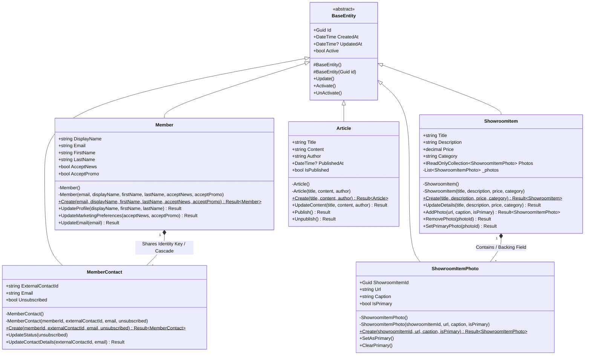

# Class Diagrams

This document contains structural class diagrams depicting the Domain entities and relationships in the Galvão system.

---

## 1. Domain Entities Structural Diagram

The following class diagram models the core domain models defined in the `Galvao.Domain` layer, showcasing attributes, methods, inheritance, and cardinality.

### Class Model Specification
* **BaseEntity**: The foundation class containing record identifiers and auditing fields (`CreatedAt`, `UpdatedAt`). It uses C# 12 `Guid.CreateVersion7()` to produce sequential, database-friendly UUIDs for primary keys.
* **Member**: Holds profile details. Has a strict one-to-one relationship mapped in the database with both:
  * The ASP.NET Core Identity `Account` (which holds username, email hash, and security tokens).
  * The `MemberContact` (which records CRM newsletter segments and unsubscribe flag).
* **MemberContact**: Tracks external marketing states. By sharing the primary key with `Member`, it guarantees integrity while avoiding composite navigation lookup overheads.
* **ShowroomItem**: Exposes showroom items. Controls access to photos via an encapsulated read-only collection `IReadOnlyCollection<ShowroomItemPhoto>`, backed by a private list field `_photos`. Mapped in EF Core using `PropertyAccessMode.Field`.
* **ShowroomItemPhoto**: Models image URLs. Mapped via cascade delete to their parent `ShowroomItem`.
* **Article**: Business model representing news content. Exposes behavior endpoints (`Publish()`, `Unpublish()`) to mutate publication state constraints.
