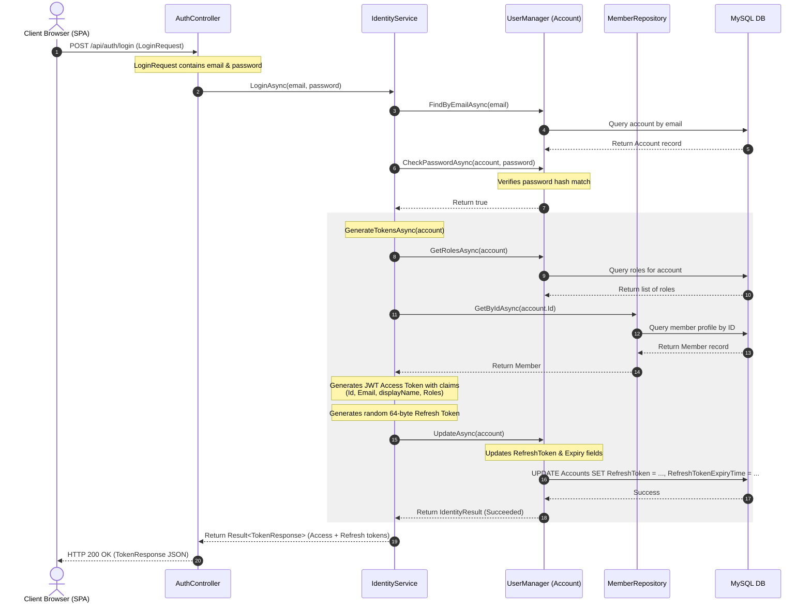
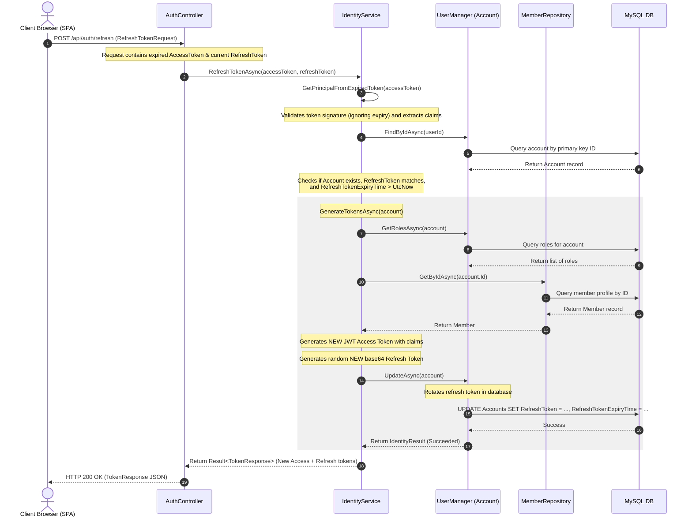

# Authentication & Token Rotation Sequence Diagrams

This document contains sequence diagrams detailing the user authentication (login) and silent token renewal (refresh) flows in the Galvão system.

---

## 1. User Login Sequence Flow

This sequence diagram illustrates the login workflow (`LoginAsync` in `IdentityService`), verifying the credentials of an existing account, reading member details for claim attachment, generating security tokens, and updating the refresh token in the database.

### Sequence Flow Description
1. The client browser issues a `POST /api/auth/login` containing the user's email and plain text password.
2. `AuthController` delegates the credentials validation to `IdentityService.LoginAsync`.
3. `IdentityService` retrieves the user's `Account` record from the database by email using the `UserManager`.
4. It verifies the hashed password using the standard `UserManager.CheckPasswordAsync`.
5. If the password matches, the token generation flow `GenerateTokensAsync` is triggered:
   - Queries roles associated with the account.
   - Queries the local `Member` profile using the `MemberRepository` to retrieve the `DisplayName` claim.
   - Signs a new JWT Access Token containing name, email, display name, and role claims.
   - Generates a cryptographically secure 64-byte random Refresh Token.
6. The account's `RefreshToken` and `RefreshTokenExpiryTime` columns are updated, and the record is persisted via `UserManager.UpdateAsync` to the database.
7. The JWT Access Token and Refresh Token are packaged into a `TokenResponse` and returned as an HTTP 200 OK JSON response.

---

## 2. Token Rotation (Refresh) Sequence Flow

This sequence diagram depicts the silent token renewal process (`RefreshTokenAsync` in `IdentityService`) where an expired access token is exchanged for a new pair of access and refresh tokens, enforcing rotation.

### Sequence Flow Description
1. The client browser interceptor, detecting an HTTP 401 Unauthorized status, extracts the expired JWT access token and active refresh token from local storage, sending them via `POST /api/auth/refresh`.
2. `AuthController` calls `RefreshTokenAsync` on `IdentityService`.
3. `IdentityService` parses the expired token and extracts name claims using a relaxed token handler validation (bypassing lifetime constraints but enforcing signature validity).
4. The service reads the user's `Account` by ID.
5. It verifies that the stored database refresh token matches the client's token, and checks that the token's lifetime has not expired.
6. A new Access Token and a rotated Refresh Token are generated.
7. The database record is updated with the new rotated refresh token and a refreshed expiration timestamp.
8. The new tokens are returned to the client, permitting the original HTTP request to be automatically retried.
