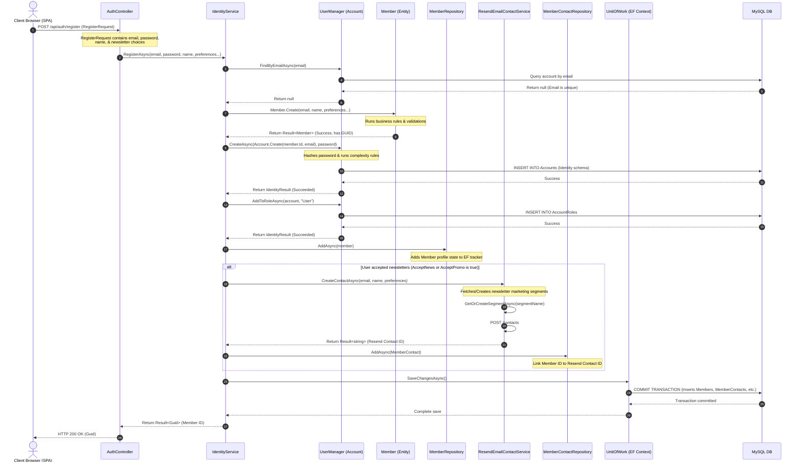
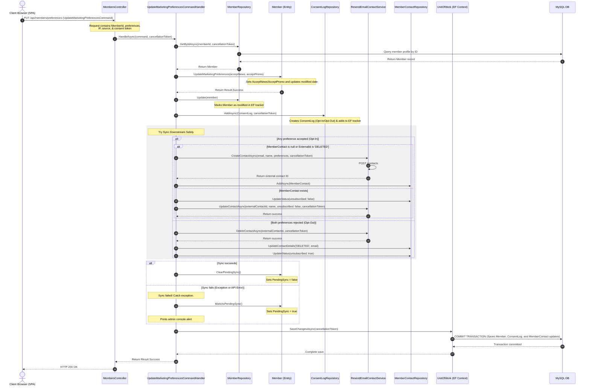

# Sequence Diagrams

This document contains sequence diagrams showing the runtime interaction of components during core operations.

---

## 1. Member Registration & CRM Sync Sequence Flow

This sequence diagram depicts the detailed step-by-step process of user registration (`RegisterAsync` in `IdentityService`), including credential setup, validation, profile saving, and Resend integration.

### Sequence Flow Description
1. The client browser issues a `POST /api/auth/register` with JSON body payload containing member details.
2. `AuthController` receives the DTO request and calls `RegisterAsync` on `IdentityService`.
3. `IdentityService` checks for email duplicate in ASP.NET Core Identity.
4. If unique, it calls the `Member.Create` static domain factory to validate name fields and preferences.
5. It then attempts to register credentials using the ASP.NET Core Identity `UserManager`. The system hashes passwords and updates ASP.NET Core Identity database tables.
6. The created user is assigned the default `"User"` role.
7. The local profile (`Member`) is queued for database insertion via `IMemberRepository.AddAsync`.
8. **Conditional CRM Sync**: If newsletter/marketing preferences are active, `ResendEmailContactService` sends an HTTP POST request to the external Resend API, returning the CRM's external contact identifier.
9. A `MemberContact` tracking record (linking the local account ID to the Resend ID) is queued in EF Core.
10. `UnitOfWork.SaveChangesAsync` is called, executing a MySQL write transaction, persisting both the user profile and the external sync tracking details.
11. A successful HTTP response is returned to the frontend.

---

## 2. Audited Marketing Preferences Update Sequence Flow

This sequence diagram depicts the detailed step-by-step runtime interaction when a user updates their marketing preferences (`UpdateMarketingPreferencesCommandHandler` in `Galvao.Application`), showing the consent logging and decoupled, error-tolerant downstream sync to Resend.

### Sequence Flow Description
1. The client browser issues a `PUT /api/members/preferences` with preference flags and auditing information (IP, Source, Consent Token).
2. `MembersController` delegates the command execution to `UpdateMarketingPreferencesCommandHandler.HandleAsync`.
3. The handler queries the `Member` record from the `MemberRepository`.
4. It calls `Member.UpdateMarketingPreferences` to update the flags in the local entity, and updates the repository state.
5. It instantiates a new `ConsentLog` record representing the explicit consent action ("Opt-In" / "Opt-Out") along with IP, Source, and Consent Token, adding it to the `ConsentLogRepository`.
6. **Downstream CRM Synchronization**:
   - The handler runs the sync in a safe wrapper.
   - If opting in, it creates a new contact in Resend (if missing/deleted) or updates the existing one to subscribed.
   - If opting out, it deletes the contact in Resend and marks the tracking record `MemberContact` as unsubscribed/DELETED.
7. **Sync Status Reconciliation**:
   - If the Resend API operations complete without error, the member is marked `PendingSync = false`.
   - If the Resend API throws an error (e.g. timeout, DNS issue, API key error), the exception is caught, the member is marked `PendingSync = true`, and a warning is logged to the server logs.
8. `UnitOfWork.SaveChangesAsync` persists all local changes (Member preferences, ConsentLog ledger, MemberContact tracking, and `PendingSync` state) to the MySQL database in a single transaction.
9. A successful response is returned to the client browser.
