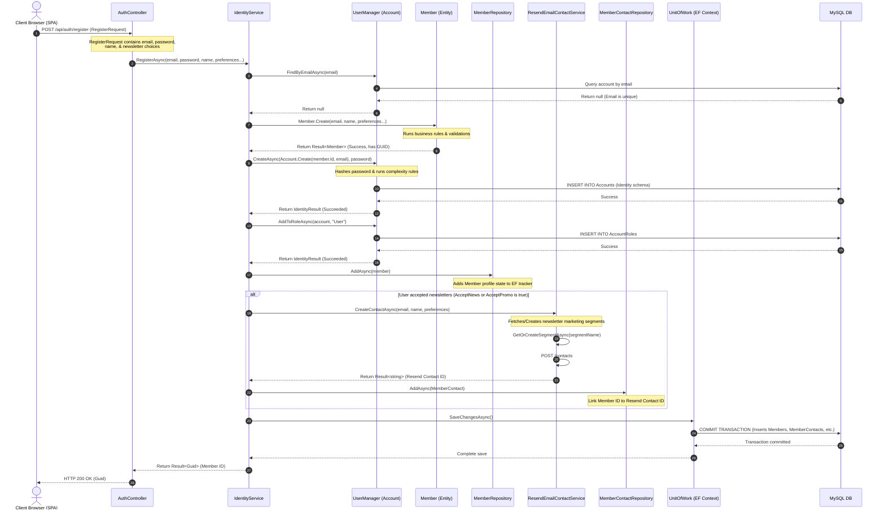

# Sequence Diagrams

This document contains sequence diagrams showing the runtime interaction of components during core operations.

---

## 1. Member Registration & CRM Sync Sequence Flow

This sequence diagram depicts the detailed step-by-step process of user registration (`RegisterAsync` in `IdentityService`), including credential setup, validation, profile saving, and Resend integration.

### Sequence Flow Description
1. The client browser issues a `POST /api/auth/register` with JSON body payload containing member details.
2. `AuthController` receives the DTO request and calls `RegisterAsync` on `IdentityService`.
3. `IdentityService` checks for email duplicate in ASP.NET Core Identity.
4. If unique, it calls the `Member.Create` static domain factory to validate name fields and preferences.
5. It then attempts to register credentials using the ASP.NET Core Identity `UserManager`. The system hashes passwords and updates ASP.NET Core Identity database tables.
6. The created user is assigned the default `"User"` role.
7. The local profile (`Member`) is queued for database insertion via `IMemberRepository.AddAsync`.
8. **Conditional CRM Sync**: If newsletter/marketing preferences are active, `ResendEmailContactService` sends an HTTP POST request to the external Resend API, returning the CRM's external contact identifier.
9. A `MemberContact` tracking record (linking the local account ID to the Resend ID) is queued in EF Core.
10. `UnitOfWork.SaveChangesAsync` is called, executing a MySQL write transaction, persisting both the user profile and the external sync tracking details.
11. A successful HTTP response is returned to the frontend.
