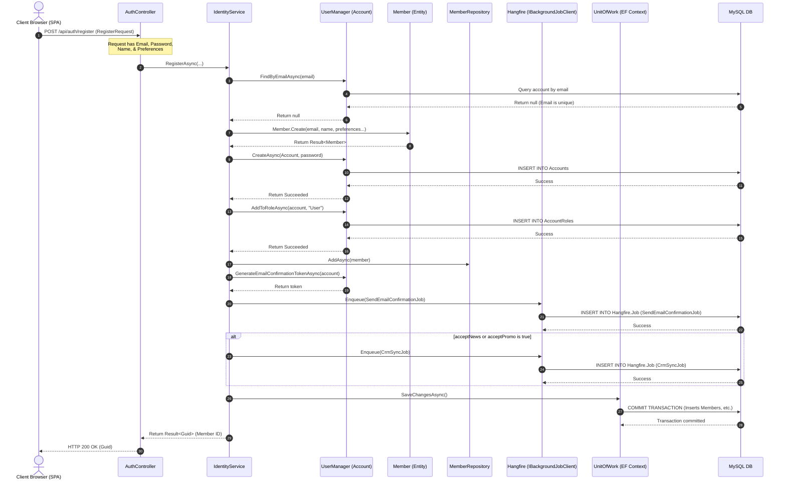
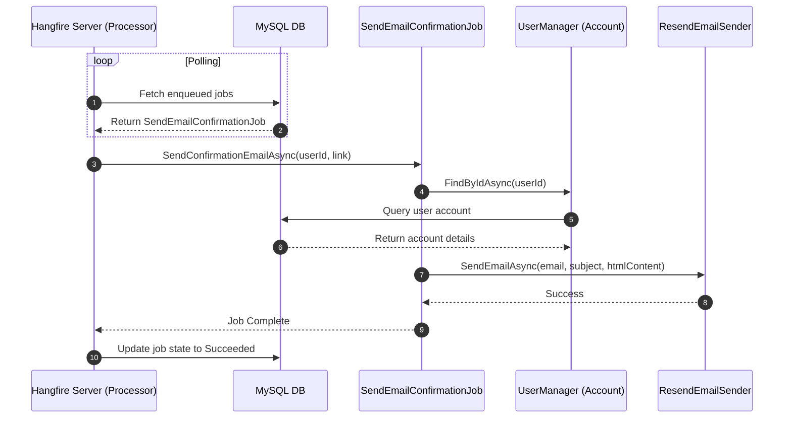
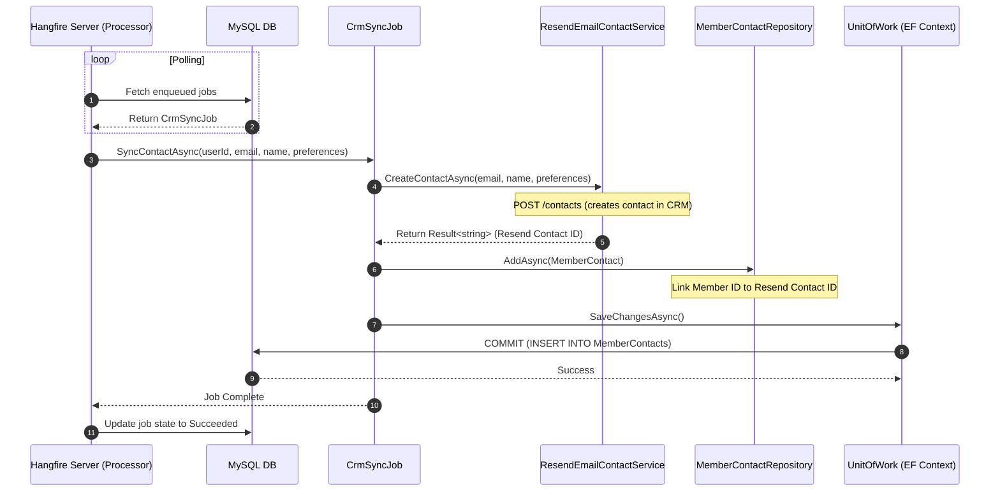
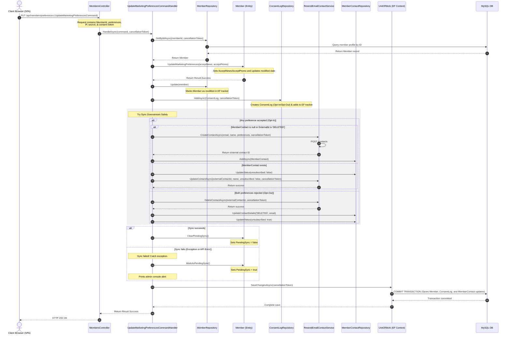

# Sequence Diagrams

This document contains sequence diagrams showing the runtime interaction of components during core operations.

---

## 1. Member Registration & CRM Sync Flows

To improve readability and usability, the user registration process is divided into three focused sequence flows:
* **1.1. Registration Transaction & Job Enqueueing:** The synchronous HTTP registration phase that sets up the local user profile and queues background tasks.
* **1.2. Email Confirmation Background Job:** Asynchronous execution of sending the verification email.
* **1.3. CRM (Resend) Sync Background Job:** Asynchronous integration that synchronizes the subscriber information with Resend and updates tracking.

---

### 1.1. Registration Transaction & Job Enqueueing

This diagram depicts the synchronous registration transaction, credential setup, local profile staging, token generation, and Hangfire job enqueueing.

**Description:**
1. The SPA client calls `POST /api/auth/register` with signup details.
2. `IdentityService.RegisterAsync` validates email uniqueness and runs domain entity validations (`Member.Create`).
3. An Identity `Account` is registered with the default `"User"` role.
4. The service generates a verification token and schedules a `SendEmailConfirmationJob` with Hangfire.
5. If the user opted into marketing/newsletters, it also schedules a `CrmSyncJob` with Hangfire.
6. The transaction is committed locally, returning the Member ID to the client instantly.

---

### 1.2. Email Confirmation Background Job

This diagram shows how the Hangfire server processes the enqueued email job in the background.

**Description:**
1. A background worker from the Hangfire pool pulls `SendEmailConfirmationJob` from the database queue.
2. The job checks user presence via `UserManager`.
3. It sends a stylized HTML validation email via `ResendEmailSender` and marks the job as successfully completed.

---

### 1.3. CRM (Resend) Sync Background Job

This diagram depicts how the Hangfire server processes the enqueued CRM contact sync to Resend.

**Description:**
1. The background worker pulls `CrmSyncJob` from the database queue.
2. The job triggers `ResendEmailContactService.CreateContactAsync` which calls Resend API's `/contacts` endpoint.
3. Upon receiving the external Contact ID from Resend, the job instantiates a `MemberContact` entity.
4. It persists this mapping to the database, completing the task. If any API errors occur, Hangfire automatically retries the task later.

---

## 2. Audited Marketing Preferences Update Sequence Flow

This sequence diagram depicts the detailed step-by-step runtime interaction when a user updates their marketing preferences (`UpdateMarketingPreferencesCommandHandler` in `Galvao.Application`), showing the consent logging and decoupled, error-tolerant downstream sync to Resend.

### Sequence Flow Description
1. The client browser issues a `PUT /api/members/preferences` with preference flags and auditing information (IP, Source, Consent Token).
2. `MembersController` delegates the command execution to `UpdateMarketingPreferencesCommandHandler.HandleAsync`.
3. The handler queries the `Member` record from the `MemberRepository`.
4. It calls `Member.UpdateMarketingPreferences` to update the flags in the local entity, and updates the repository state.
5. It instantiates a new `ConsentLog` record representing the explicit consent action ("Opt-In" / "Opt-Out") along with IP, Source, and Consent Token, adding it to the `ConsentLogRepository`.
6. **Downstream CRM Synchronization**:
   - The handler runs the sync in a safe wrapper.
   - If opting in, it creates a new contact in Resend (if missing/deleted) or updates the existing one to subscribed.
   - If opting out, it deletes the contact in Resend and marks the tracking record `MemberContact` as unsubscribed/DELETED.
7. **Sync Status Reconciliation**:
   - If the Resend API operations complete without error, the member is marked `PendingSync = false`.
   - If the Resend API throws an error (e.g. timeout, DNS issue, API key error), the exception is caught, the member is marked `PendingSync = true`, and a warning is logged to the server logs.
8. `UnitOfWork.SaveChangesAsync` persists all local changes (Member preferences, ConsentLog ledger, MemberContact tracking, and `PendingSync` state) to the MySQL database in a single transaction.
9. A successful response is returned to the client browser.
