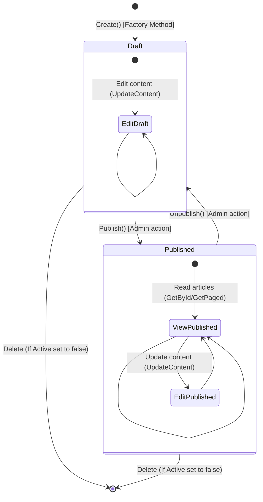
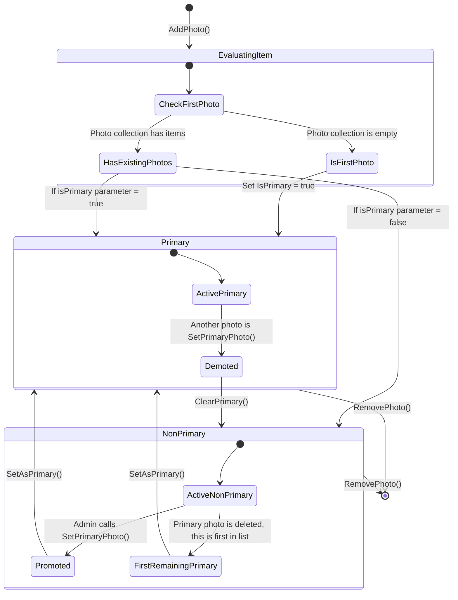

# State Diagrams

This document describes the state transitions and lifecycles of core domain objects in the Galvão system.

---

## 1. Article Lifecycle State Diagram

This state diagram models the publishing workflow of a news article.

### Article State Specifications
* **Draft State**:
  * **Properties**: `IsPublished = false`, `PublishedAt = null`.
  * **Rules**: Hidden from guest users. Only administrators can view and edit drafts.
* **Published State**:
  * **Properties**: `IsPublished = true`, `PublishedAt = DateTime.Now`.
  * **Rules**: Visible to everyone (Guests and Members). Updates are allowed, but the article remains published.
* **Transitions**:
  * **Publish()**: Changes state to `Published`, assigns current timestamp. Fails if already published.
  * **Unpublish()**: Reverts state back to `Draft`, clearing `PublishedAt`. Fails if not published.

---

## 2. Showroom Item Photo Priority State Diagram

This state diagram models the primary flag transitions of photos within a `ShowroomItem`.

### Photo Priority State Specifications
* **Primary State**:
  * **Properties**: `IsPrimary = true`.
  * **Rules**: Only **one** photo per `ShowroomItem` can be primary. The primary photo is displayed as the main card image in the showroom listing page.
* **Non-Primary State**:
  * **Properties**: `IsPrimary = false`.
  * **Rules**: Displayed in the showroom detail page photo gallery.
* **Transitions**:
  * **SetPrimaryPhoto()**: Sets the target photo's `IsPrimary` to `true` and loops through all other photos in the item to call `ClearPrimary()` (changing them to `false`).
  * **RemovePhoto()**: If the deleted photo is primary, the first remaining photo in the item's `Photos` list is automatically promoted to `Primary`.
