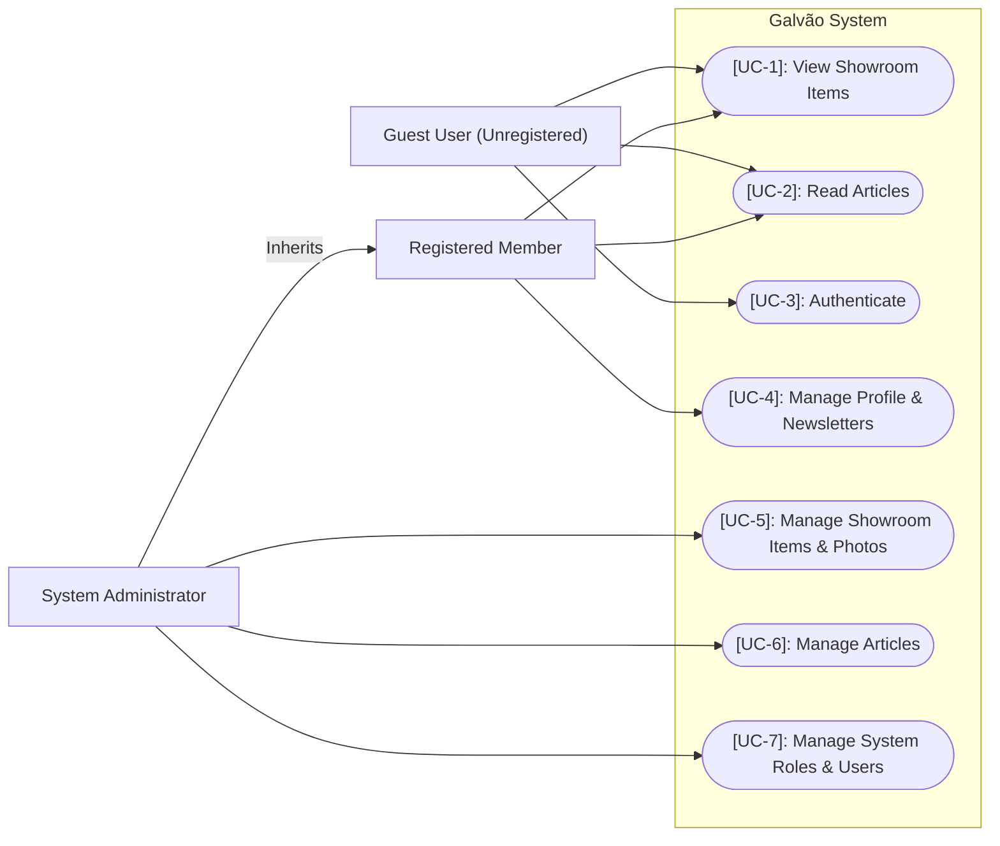

# Use Case Diagrams

This document illustrates the use cases of the Galvão system, identifying the primary actors, features, and their relationships.

---

## Use Case Diagram

---

## Detailed Use Cases Specifications

### [UC-1]: View Showroom Items
* **Actors**: Guest User, Registered Member
* **Description**: Allows any user to browse the list of showroom items and view their details, prices, categories, and associated images.
* **Pre-conditions**: None.
* **Post-conditions**: The user receives a list or details of showroom items from the database.

### [UC-2]: Read Articles
* **Actors**: Guest User, Registered Member
* **Description**: Allows any user to read published news articles.
* **Pre-conditions**: The article must have its `IsPublished` state set to `true`.
* **Post-conditions**: The user views the article content.

### [UC-3]: Authenticate
* **Actors**: Guest User
* **Description**: Allows a guest user to register a new account (creating an identity account and member profile) or log into an existing account to receive Access/Refresh JWT tokens.
* **Pre-conditions**: For registration, the email must be unique. For login, credentials must match.
* **Post-conditions**: JWT token responses containing standard user roles claims are issued.

### [UC-4]: Manage Profile & Newsletters
* **Actors**: Registered Member
* **Description**: Allows an authenticated user to update their display name, contact email, and marketing subscription preferences (newsletters/promotions).
* **Pre-conditions**: The user must be authenticated with a valid JWT token.
* **Post-conditions**: The local profile is updated, and changes are synchronized with the Resend CRM service.

### [UC-5]: Manage Showroom Items & Photos
* **Actors**: System Administrator
* **Description**: Enables administrators to create new showroom listings, edit details (price, category, descriptions), upload/link new photos, delete photos, or mark a photo as primary.
* **Pre-conditions**: The user must be logged in with the `Admin` role.
* **Post-conditions**: The showroom item details or associated photos collection is updated in the database.

### [UC-6]: Manage Articles
* **Actors**: System Administrator
* **Description**: Allows administrators to draft, update, publish, or unpublish news articles.
* **Pre-conditions**: The user must be logged in with the `Admin` role.
* **Post-conditions**: The article's content changes or state flags (`IsPublished`, `PublishedAt`) are modified in the database.

### [UC-7]: Manage System Roles & Users
* **Actors**: System Administrator
* **Description**: Allows administrators to view available roles, create new roles, assign roles to accounts, remove roles, or block/unblock users.
* **Pre-conditions**: The user must be logged in with the `Admin` role.
* **Post-conditions**: User authorization mappings are modified in the ASP.NET Identity system.
